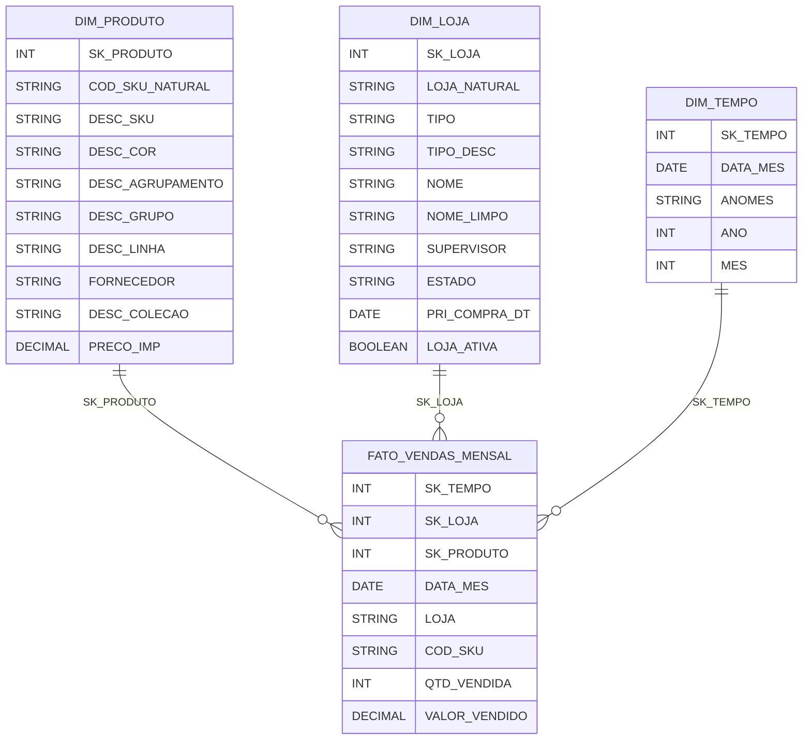
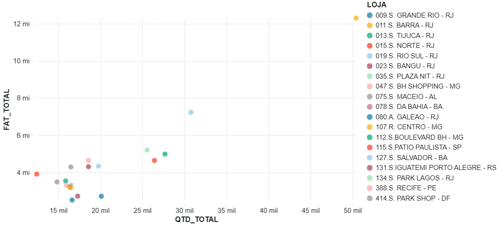
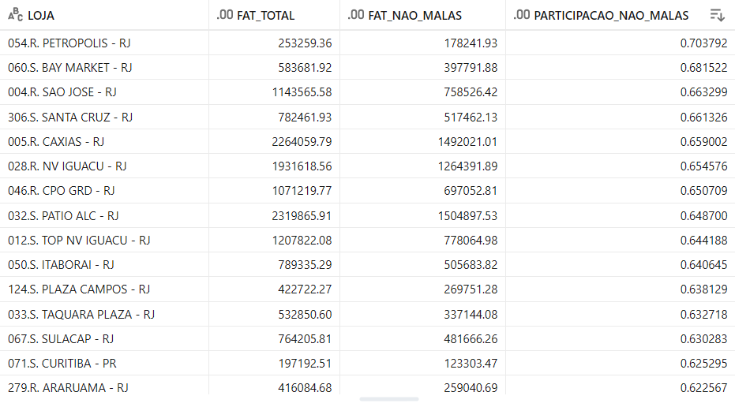

# MVP – Engenharia de Dados | PUC-Rio - Diana Serano

Este projeto tem como objetivo a construção de um pipeline de dados em nuvem, utilizando conceitos e práticas de Engenharia de Dados, com foco na coleta, transformação, modelagem e análise de dados estruturados.

O trabalho foi desenvolvido no contexto da disciplina de Engenharia de Dados da Pós-graduação em Ciência de Dados da PUC-Rio e utiliza dados reais de uma empresa do setor varejista de artigos de viagem, abrangendo informações de produtos, lojas e faturamento.

A solução proposta contempla a utilização da plataforma Databricks como ambiente de processamento e armazenamento, adotando uma arquitetura em camadas (Bronze, Silver e Gold) e modelagem em esquema estrela, com o objetivo de organizar os dados de forma escalável, auditável e analiticamente eficiente.

Ao final do pipeline, são realizadas análises exploratórias e analíticas com o propósito de responder perguntas de negócio relacionadas ao desempenho comercial das lojas, ao mix de produtos e à escala de vendas, respeitando critérios de qualidade dos dados e boas práticas de engenharia.

## 2. Objetivo do Trabalho

O objetivo deste MVP é desenvolver um pipeline de dados em nuvem capaz de transformar dados operacionais brutos em informações analíticas estruturadas, permitindo a análise do desempenho de vendas no nível de loja e produto.

A partir dos dados disponibilizados, o trabalho busca responder a perguntas de negócio relacionadas à escala de vendas, composição do mix de produtos e diferenças de desempenho entre lojas, utilizando métricas de volume de peças vendidas, faturamento e participação de categorias.

As análises realizadas neste projeto são guiadas pelas seguintes perguntas:

1 Desempenho por Categoria

1. Quais categorias de produto apresentam maior contribuição para o faturamento mensal da empresa?
2. Em quais períodos (meses/estações) cada categoria performa melhor ou pior?
3. Quais categorias possuem maior potencial de crescimento além das malas, que hoje representam a maior fatia da receita?

2 Desempenho por Região

1. Identificar quais estados demonstram maior abertura para categorias que não sejam apenas malas.
2. Avaliar em quais regiões a marca é percebida de forma mais ampla, consumindo outras categorias.

3 Eficiência Comercial
1. Qual estado apresenta o melhor PA (peças por atendimento) médio?
2. Há diferenças de performance entre lojas de shopping e lojas de rua?
3. Quais categorias possuem maior ticket médio por estado/loja?


Essas perguntas guiam tanto a modelagem das dimensões quanto a estrutura da tabela fato.

Durante a fase inicial de exploração dos dados, foram consideradas perguntas adicionais relacionadas à eficiência comercial, como métricas de atendimento e ticket médio por loja. No entanto, ao longo do desenvolvimento do pipeline e da análise de qualidade dos dados, identificou-se a ausência de informações necessárias para responder a essas questões de forma consistente.

Diante disso, o escopo analítico foi refinado, priorizando perguntas plenamente suportadas pelos dados disponíveis, com foco em métricas de volume de vendas, faturamento e composição do mix de produtos. Esse processo de refinamento garantiu maior robustez às análises realizadas e alinhamento entre os objetivos do trabalho e as evidências extraídas dos dados.

## 3. Fonte e Coleta dos Dados

Os dados utilizados neste projeto são provenientes de uma única fonte interna, correspondente a uma empresa do setor varejista de artigos de viagem. Para fins deste MVP, os dados foram disponibilizados em formato CSV para uso analítico, abrangendo informações de produtos, lojas e faturamento.

Apesar de os dados terem origem em sistemas corporativos, neste trabalho eles são tratados exclusivamente como arquivos estruturados em CSV, sem a necessidade de acesso direto aos sistemas transacionais. Essa abordagem permitiu focar no desenvolvimento do pipeline de dados e nas etapas de transformação e análise, em conformidade com os objetivos acadêmicos do projeto.

Foram utilizados três conjuntos de dados principais:
- **Produtos**, contendo atributos descritivos e categóricos dos itens comercializados;
- **Lojas**, contendo informações cadastrais e de localização dos pontos de venda;
- **Faturamento**, contendo registros de vendas e devoluções, com aproximadamente 900 mil linhas.

Os dados de faturamento contemplam exclusivamente o ano de 2025, organizados por período no formato ano-mês, com registros até o início de dezembro. Em função disso, o mês de dezembro foi desconsiderado em algumas análises temporais, a fim de evitar distorções decorrentes de período incompleto.

A etapa de coleta consistiu no carregamento manual dos arquivos CSV para a plataforma Databricks, utilizando **Volumes no Unity Catalog** como camada de armazenamento. A partir desses volumes, os dados foram lidos diretamente no ambiente Spark para dar início ao pipeline de transformação.

Não foram utilizadas técnicas de web scraping, APIs ou processos automatizados de extração, uma vez que os dados já se encontravam estruturados e disponíveis para análise. Dessa forma, a etapa de coleta pode ser considerada simples, porém adequada ao escopo do MVP.

Por se tratarem de dados reais de uma empresa privada, cuidados adicionais foram adotados quanto à confidencialidade. O uso dos dados foi autorizado para fins exclusivamente acadêmicos, sem a divulgação do nome da empresa ou de informações estratégicas sensíveis, mantendo o foco nas análises agregadas e nos conceitos técnicos abordados ao longo do trabalho.


## 4. Modelagem de Dados

A modelagem deste MVP foi estruturada para suportar análises no estilo **Data Warehouse**, utilizando **Esquema Estrela (Star Schema)** na camada **Gold**. Para garantir organização, rastreabilidade e evolução do pipeline, os dados foram separados em três camadas (schemas) no Databricks:

- **Bronze**: dados brutos ingeridos dos CSVs, preservando o formato original;
- **Silver**: dados tratados e padronizados (tipos, limpeza de strings, datas e numéricos);
- **Gold**: modelo dimensional final, com dimensões e tabela fato prontas para análise.

### 4.1 Granularidade e fatos

A tabela fato foi desenhada com granularidade **mensal por loja e por produto**, alinhada ao dado disponível no conjunto de faturamento (campo `ANOMES`) e ao objetivo analítico do projeto.

A tabela **`gold.fato_vendas_mensal`** consolida as métricas:
- `QTD_VENDIDA` (soma de quantidade, incluindo devoluções quando negativas);
- `VALOR_VENDIDO` (soma de valor, incluindo devoluções quando negativas).

### 4.2 Dimensões do modelo

O esquema estrela utiliza três dimensões principais:

- **Dimensão Produto (`gold.dim_produto`)**
  - Chave natural: `COD_SKU_NATURAL` (SKU do produto)
  - Atributos descritivos e categóricos: descrição, cor, categorias (agrupamento/grupo/linha), fornecedor, coleção e preço de importação (`PRECO_IMP`).

- **Dimensão Loja (`gold.dim_loja`)**
  - Chave natural: `LOJA_NATURAL`
  - Atributos: tipo/canal (ex.: loja própria, e-commerce), nome, estado, supervisor, data de primeira compra (`PRI_COMPRA_DT`) e flag de loja ativa (`LOJA_ATIVA`).

- **Dimensão Tempo (`gold.dim_tempo`)**
  - Baseada no primeiro dia do mês (`DATA_MES`) derivado do campo `ANOMES`.
  - Atributos: `ANOMES`, `ANO`, `MES`.

### 4.3 Chaves naturais e Surrogate Keys (SK)

Apesar das chaves naturais existirem nos dados (ex.: `COD_SKU`, `LOJA` e `DATA_MES`), a camada Gold adota **Surrogate Keys (SKs)** para:

- padronizar relacionamentos entre dimensões e fato;
- simplificar joins e consumo analítico;
- permitir evolução futura (ex.: alterações em chaves naturais, mudanças de cadastro, cenários de SCD).

Assim, cada dimensão recebe uma chave substituta:
- `SK_PRODUTO`, `SK_LOJA`, `SK_TEMPO`.

A tabela fato armazena as SKs como chaves de relacionamento (FKs analíticas):
- `SK_PRODUTO`, `SK_LOJA`, `SK_TEMPO`.

Além disso, a fato também mantém as **chaves naturais** (`COD_SKU`, `LOJA`, `DATA_MES`) como colunas de contexto, facilitando auditoria e validações.

### 4.4 Esquema estrela (visão conceitual)




### 5. Catálogo de Dados

Esta seção apresenta o Catálogo de Dados do MVP, descrevendo as principais tabelas do modelo analítico, seus atributos, tipos e domínios esperados. O catálogo tem como foco a **camada Gold**, que concentra os dados prontos para análise, com referência às tabelas da camada Silver utilizadas como base de transformação.

A modelagem adota um **esquema estrela**, composto por uma tabela fato central e três tabelas dimensão.

---

### 5.1 Dimensão Produto – `gold.dim_produto`

Tabela dimensão que armazena informações descritivas e categóricas dos produtos comercializados.

**Granularidade:** 1 linha por produto (SKU).

| Coluna | Tipo | Descrição | Domínio / Observações |
|------|------|-----------|----------------------|
| SK_PRODUTO | INT | Chave substituta da dimensão produto | Gerada sequencialmente |
| COD_SKU_NATURAL | STRING | Código natural do produto (SKU) | 13 dígitos, pode iniciar com zero |
| DESC_SKU | STRING | Descrição do produto | Texto em maiúsculo |
| DESC_COR | STRING | Cor do produto | Categórico |
| DESC_GRUPO | STRING | Categoria nível 1 | Ex.: MALAS, MOCHILAS |
| DESC_LINHA | STRING | Categoria nível 2 | Subcategoria |
| DESC_AGRUPAMENTO | STRING | Categoria nível 3 | Linha do produto |
| FORNECEDOR | STRING | Fornecedor do produto | Texto |
| DESC_COLECAO | STRING | Coleção do produto | Pode conter valores nulos |
| PRECO_IMP | DECIMAL(18,2) | Preço de importação | Nulo para produtos não importados |

---

### 5.2 Dimensão Loja – `gold.dim_loja`

Tabela dimensão que armazena dados cadastrais e atributos de contexto das lojas.

**Granularidade:** 1 linha por loja.

| Coluna | Tipo | Descrição | Domínio / Observações |
|------|------|-----------|----------------------|
| SK_LOJA | INT | Chave substituta da dimensão loja | Gerada sequencialmente |
| LOJA_NATURAL | STRING | Código natural da loja | Identificador do ponto de venda |
| TIPO | STRING | Código do tipo de loja | I, A, P, F, E |
| TIPO_DESC | STRING | Descrição do tipo de loja | Importadora, Loja Própria, Franquia, E-commerce |
| NOME | STRING | Nome original da loja | Pode conter prefixo "X" para lojas fechadas |
| NOME_LIMPO | STRING | Nome da loja sem prefixos | Texto tratado |
| SUPERVISOR | STRING | Supervisor responsável | Texto |
| ESTADO | STRING | Estado da loja | Sigla UF |
| PRI_COMPRA_DT | DATE | Data da primeira compra da loja | Pode conter valores nulos |
| LOJA_ATIVA | BOOLEAN | Indicador de loja ativa | TRUE/FALSE |

---

### 5.3 Dimensão Tempo – `gold.dim_tempo`

Tabela dimensão temporal derivada dos dados de faturamento.

**Granularidade:** 1 linha por mês.

| Coluna | Tipo | Descrição | Domínio / Observações |
|------|------|-----------|----------------------|
| SK_TEMPO | INT | Chave substituta da dimensão tempo | Gerada sequencialmente |
| DATA_MES | DATE | Primeiro dia do mês | Usado para joins temporais |
| ANOMES | STRING | Período no formato YYYYMM | Ex.: 202501 |
| ANO | INT | Ano da venda | 2025 |
| MES | INT | Mês da venda | 1 a 12 |

---

### 5.4 Tabela Fato – `gold.fato_vendas_mensal`

Tabela fato central do modelo, contendo as métricas agregadas de vendas.

**Granularidade:** 1 linha por mês, por loja e por produto.

| Coluna | Tipo | Descrição | Domínio / Observações |
|------|------|-----------|----------------------|
| SK_TEMPO | INT | FK para dim_tempo | Relacionamento temporal |
| SK_LOJA | INT | FK para dim_loja | Relacionamento com loja |
| SK_PRODUTO | INT | FK para dim_produto | Relacionamento com produto |
| DATA_MES | DATE | Mês de referência | Primeiro dia do mês |
| LOJA | STRING | Código natural da loja | Mantido para auditoria |
| COD_SKU | STRING | Código natural do produto | Mantido para auditoria |
| QTD_VENDIDA | INT | Quantidade vendida no período | Pode ser negativa (devoluções) |
| VALOR_VENDIDO | DECIMAL(18,2) | Valor financeiro das vendas | Pode ser negativo (devoluções) |

---

### 5.5 Linhagem dos Dados (Resumo)

- **Bronze:** ingestão direta dos arquivos CSV originais.
- **Silver:** padronização de tipos, limpeza de strings, tratamento de datas e valores numéricos.
- **Gold:** deduplicação, criação de surrogate keys, agregações e materialização do esquema estrela.

O catálogo reflete o estado final dos dados após todas as transformações necessárias para garantir consistência, qualidade e suporte às análises de negócio propostas.


## 6. Processo de Carga e Transformação (ETL)

Esta seção descreve o processo de **Extração, Transformação e Carga (ETL)** implementado no MVP, detalhando como os dados brutos foram ingeridos, tratados e disponibilizados para análise nas camadas **Bronze, Silver e Gold**, utilizando **Databricks**, **Unity Catalog (Volumes)**, **Delta Lake**, **PySpark** e **SQL**.

---

### 6.1 Extração e Ingestão (Camada Bronze)

Os dados utilizados no projeto são provenientes de arquivos **CSV** (produtos, lojas e faturamento). Esses arquivos foram carregados manualmente em **Volumes do Unity Catalog** e, em seguida, ingeridos com **PySpark**, preservando o formato original (camada “bruta”).

Exemplo de leitura e carga do CSV de lojas na Bronze:

```python
path = "/Volumes/database_mvp/bronze/tabelas-dimensoes/Lojas.csv"

df_lojas = (
    spark.read
        .option("header", "true")
        .option("encoding", "ISO-8859-1")   # arquivos gerados em ambiente Excel
        .option("delimiter", ";")           # separador do CSV
        .option("escape", '"')              # permite aspas em campos textuais
        .csv(path)
)

df_lojas.write.format("delta").mode("overwrite") \
    .saveAsTable("database_mvp.bronze.lojas_raw")
```
O mesmo padrão foi aplicado para produtos_raw e faturamento_raw:
```python
# produtos
spark.read.option("header","true").option("encoding","ISO-8859-1") \
    .option("delimiter",";").option("escape",'"') \
    .csv("/Volumes/database_mvp/bronze/tabelas-dimensoes/Produtos.csv") \
    .write.format("delta").mode("overwrite") \
    .saveAsTable("database_mvp.bronze.produtos_raw")

# faturamento
spark.read.option("header","true").option("encoding","ISO-8859-1") \
    .option("delimiter",";").option("escape",'"') \
    .csv("/Volumes/database_mvp/bronze/tabelas-dimensoes/Faturamento.csv") \
    .write.format("delta").mode("overwrite") \
    .saveAsTable("database_mvp.bronze.faturamento_raw")
```

### 6.2 Transformações e Padronização (Camada Silver)

A camada **Silver** tem como objetivo transformar os dados brutos da camada Bronze em conjuntos de dados **limpos, padronizados e semanticamente consistentes**, servindo como base para a modelagem dimensional da camada Gold.

As principais transformações realizadas nesta etapa incluem:

- Padronização de tipos de dados (STRING, INT, DECIMAL, DATE);
- Remoção de espaços em branco em campos textuais;
- Normalização de textos categóricos (uso de letras maiúsculas);
- Tratamento de valores monetários com vírgula decimal;
- Conversão e validação de datas;
- Padronização de nomes de colunas e chaves entre tabelas.

---

#### 6.2.1 Transformação da dimensão Produto

Na dimensão de produtos, foram realizadas transformações para garantir consistência textual e correta tipagem dos atributos, especialmente o preço de importação, que estava representado como texto com vírgula decimal.

Exemplo de transformação aplicada:

```python
from pyspark.sql.functions import col, trim, upper, regexp_replace

df_produtos_bronze = spark.table("database_mvp.bronze.produtos_raw")

df_produtos_silver = (
    df_produtos_bronze
        .select(
            col("COD_SKU").cast("string").alias("COD_SKU"),
            trim(col("DESC_SKU")).cast("string").alias("DESC_SKU"),
            trim(col("DESC_COR")).cast("string").alias("DESC_COR"),
            trim(col("DESC_AGRUPAMENTO")).cast("string").alias("DESC_AGRUPAMENTO"),
            trim(col("DESC_GRUPO")).cast("string").alias("DESC_GRUPO"),
            trim(col("DESC_LINHA")).cast("string").alias("DESC_LINHA"),
            trim(col("FORNECEDOR")).cast("string").alias("FORNECEDOR"),
            trim(col("DESC_COLECAO")).cast("string").alias("DESC_COLECAO"),
            regexp_replace(col("PRECO_IMP"), ",", ".").alias("PRECO_IMP_LIMPO")
        )
        .withColumn("PRECO_IMP", col("PRECO_IMP_LIMPO").cast("decimal(18,2)"))
        .drop("PRECO_IMP_LIMPO")
        .withColumn("DESC_SKU", upper(col("DESC_SKU")))
        .withColumn("DESC_AGRUPAMENTO", upper(col("DESC_AGRUPAMENTO")))
        .withColumn("DESC_GRUPO", upper(col("DESC_GRUPO")))
        .withColumn("DESC_LINHA", upper(col("DESC_LINHA")))
)

df_produtos_silver.write.format("delta").mode("overwrite") \
    .saveAsTable("database_mvp.silver.dim_produto_base")
```

O campo COD_SKU foi mantido como texto, pois pode conter zeros à esquerda, o que inviabiliza seu uso como tipo numérico.

#### 6.2.2 Transformação da dimensão Loja

Na dimensão de lojas, além da padronização textual e tipagem correta dos campos, foram criados atributos derivados para enriquecer a análise, como o status de loja ativa e a descrição do tipo de loja.

Exemplo de transformação aplicada:
```python
from pyspark.sql.functions import col, trim, when, regexp_replace, try_to_date

df_lojas_bronze = spark.table("database_mvp.bronze.lojas_raw")

df_lojas_silver = (
    df_lojas_bronze
        .withColumn("LOJA", trim(col("LOJA")).cast("string"))
        .withColumn("TIPO", trim(col("TIPO")).cast("string"))
        .withColumn("NOME", trim(col("NOME")).cast("string"))
        .withColumn("SUPERVISOR", trim(col("SUPERVISOR")).cast("string"))
        .withColumn("ESTADO", trim(col("ESTADO")).cast("string"))
        .withColumn("PRI_COMPRA_DT", try_to_date(trim(col("PRI_COMPRA")), "dd/MM/yyyy"))
        .withColumn("LOJA_ATIVA", (~col("NOME").startswith("X")).cast("boolean"))
        .withColumn("NOME_LIMPO", regexp_replace(col("NOME"), "^X\\s*", ""))
        .withColumn(
            "TIPO_DESC",
            when(col("TIPO") == "I", "Importadora")
            .when(col("TIPO").isin("A", "P"), "Loja Própria")
            .when(col("TIPO") == "F", "Franquia")
            .when(col("TIPO") == "E", "E-commerce")
            .otherwise("Outro")
        )
        .select(
            "LOJA",
            "TIPO",
            "TIPO_DESC",
            "NOME",
            "NOME_LIMPO",
            "SUPERVISOR",
            "ESTADO",
            "PRI_COMPRA_DT",
            "LOJA_ATIVA"
        )
)

df_lojas_silver.write.format("delta").mode("overwrite") \
    .saveAsTable("database_mvp.silver.dim_loja_base")
```

Durante a análise de qualidade, foi identificado que o campo de data de primeira compra estava em formato yyyyMMdd. A correção foi realizada reprocessando o campo diretamente a partir da camada Bronze, garantindo a conversão correta para o tipo DATE.

#### 6.2.3 Transformação da tabela de Vendas

A tabela de faturamento foi tratada para suportar análises mensais, incluindo a criação da coluna de data no primeiro dia do mês, além da padronização das chaves de loja e produto.

Exemplo de transformação aplicada:
```python
from pyspark.sql.functions import col, substring, concat, lit, to_date, regexp_replace, trim

df_fat_bronze = spark.table("database_mvp.bronze.faturamento_raw")

df_vendas_silver = (
    df_fat_bronze
        .withColumn("ANOMES", trim(col("ANOMES")).cast("string"))
        .withColumn("ANO", substring(col("ANOMES"), 1, 4).cast("int"))
        .withColumn("MES", substring(col("ANOMES"), 5, 2).cast("int"))
        .withColumn("DATA_MES", to_date(concat(col("ANOMES"), lit("01")), "yyyyMMdd"))
        .withColumn("LOJA", trim(col("FILIAL")).cast("string"))
        .withColumn("COD_SKU", trim(col("SKU")).cast("string"))
        .withColumn("QTD", col("QTD").cast("int"))
        .withColumn(
            "VALOR",
            regexp_replace(trim(col("VALOR")).cast("string"), ",", ".")
                .cast("decimal(18,2)")
        )
        .select(
            "DATA_MES",
            "ANOMES",
            "ANO",
            "MES",
            "LOJA",
            "COD_SKU",
            "QTD",
            "VALOR"
        )
)

df_vendas_silver.write.format("delta").mode("overwrite") \
    .saveAsTable("database_mvp.silver.vendas_base")
 ```

 Ao final da camada Silver, os dados encontram-se limpos, padronizados e prontos para a modelagem dimensional na camada Gold.

## 7. Análise dos Dados

### 7.1 Qualidade dos Dados

Antes da realização das análises de negócio, foi conduzida uma avaliação da **qualidade dos dados** ao longo do pipeline, com foco nas tabelas das camadas **Silver** e **Gold**, que servem de base para o consumo analítico.

A análise de qualidade teve como principais objetivos:
- identificar inconsistências de tipo, formatação ou domínio;
- verificar a existência de valores nulos inesperados;
- garantir unicidade nas dimensões;
- validar a integridade referencial entre tabelas fato e dimensões.

---

#### 7.1.1 Verificação de valores nulos

Foram realizadas verificações de valores nulos em campos críticos, como chaves naturais, métricas e atributos de dimensão.

Exemplo de verificação na dimensão produto:

```sql
SELECT *
FROM database_mvp.silver.dim_produto_base
WHERE COD_SKU IS NULL
   OR DESC_SKU IS NULL;
```
Não foram identificados valores nulos nos campos essenciais de identificação de produto.
O campo PRECO_IMP apresentou valores nulos esperados, correspondentes a produtos não importados, o que foi considerado adequado ao domínio do dado.

---
#### 7.1.2 Padronização e consistência de tipos

Durante a análise inicial, foram identificados campos numéricos e de data armazenados como texto, exigindo tratamento explícito na camada Silver. 

Entre os principais ajustes realizados estão:
  - conversão de valores monetários representados com vírgula decimal;
  - conversão de campos de data a partir de formatos textuais;
  - padronização de códigos (COD_SKU, LOJA) como texto para preservar zeros à esquerda.
  - Após as transformações, foi realizada a validação da conversão dos campos numéricos.

Exemplo de verificação do campo VALOR após transformação:

```sql
SELECT VALOR
FROM database_mvp.silver.vendas_base
WHERE VALOR IS NULL;
```
A consulta retornou zero registros, indicando que a conversão para o tipo DECIMAL foi realizada com sucesso.

---

#### 7.1.3 Validação de datas

Durante a análise de qualidade da dimensão loja, foi identificado que o campo de data de primeira compra (PRI_COMPRA) estava armazenado como texto, resultando inicialmente em valores nulos após tentativa de conversão.

Esse problema foi tratado reprocessando o campo diretamente a partir da camada Bronze, garantindo a conversão correta para o tipo DATE.

Exemplo de validação após correção:
```sql
SELECT
  COUNT(*) AS total,
  SUM(CASE WHEN PRI_COMPRA_DT IS NULL THEN 1 ELSE 0 END) AS datas_invalidas
FROM database_mvp.silver.dim_loja_base;
```

Após o ajuste, a maior parte dos registros apresentou datas válidas, permanecendo valores nulos apenas quando o dado original não estava disponível, o que foi considerado aceitável.


---
#### 7.1.4 Verificação de duplicidades nas dimensões

Foi realizada a verificação de duplicidade de registros nas dimensões, garantindo a unicidade das chaves naturais antes da geração das surrogate keys na camada Gold.

Exemplo de verificação na dimensão loja:
```sql
SELECT LOJA, COUNT(*) AS qtde
FROM database_mvp.silver.dim_loja_base
GROUP BY LOJA
HAVING COUNT(*) > 1;
```

Nenhuma duplicidade foi identificada após os processos de limpeza e padronização.

---

#### 7.1.5 Integridade referencial entre fato e dimensões

Na camada Gold, foi verificada a integridade referencial entre a tabela fato e as dimensões, assegurando que todas as chaves estrangeiras possuíam correspondência válida nas tabelas dimensionais.

Exemplo de validação de integridade:
```sql
SELECT COUNT(*)
FROM database_mvp.gold.fato_vendas_mensal
WHERE SK_PRODUTO NOT IN (
    SELECT SK_PRODUTO
    FROM database_mvp.gold.dim_produto
);
```

Consultas semelhantes foram realizadas para SK_LOJA e SK_TEMPO, não sendo identificadas violações de integridade.

---


#### 7.1.6 Considerações finais sobre a qualidade dos dados

A análise de qualidade demonstrou que, após as transformações realizadas na camada Silver, os dados apresentaram nível adequado de consistência, padronização e integridade para suportar as análises propostas neste MVP.

Os principais problemas identificados — relacionados a formatação de datas e valores numéricos — foram tratados durante o pipeline, reforçando a importância da etapa de validação de qualidade antes do consumo analítico.

Com isso, os dados da camada Gold foram considerados aptos para responder às perguntas de negócio definidas nos objetivos do trabalho.


---


## 7.2 Solução do Problema

Esta seção apresenta a solução analítica do problema proposto no MVP, conectando os resultados obtidos a partir das consultas SQL e visualizações realizadas no Databricks às perguntas de negócio definidas nos objetivos do trabalho. As análises foram estruturadas em três blocos principais: desempenho por categoria, desempenho por região e escala de vendas por loja. As queries estao disponiveis no notebook de analises e nessa documentação vou trazer alguns pontos.


---
###7.2.1 Desempenho por Categoria

Perguntas analisadas:

  - Quais categorias de produto apresentam maior contribuição para o faturamento mensal da empresa?
  - Em quais períodos cada categoria performa melhor ou pior?
  - Quais categorias possuem maior potencial de crescimento além das malas?

Abordagem analítica:

  Para responder a essas questões, foi utilizada a tabela fato gold.fato_vendas_mensal, agregando o faturamento e a quantidade vendida por categoria ao longo do tempo. As análises consideraram exclusivamente meses completos, com a exclusão de dezembro de 2025, a fim de evitar distorções causadas por período incompleto.

Principais achados:
A categoria Malas apresenta, de forma consistente, a maior contribuição para o faturamento total da empresa, confirmando sua relevância estratégica no portfólio. Entretanto, categorias como Cotidiano, Mochilas e Escolares demonstram comportamento de crescimento relevante em determinados períodos do ano, sugerindo potencial de expansão e diversificação do mix.


A análise de variação mensal indica que algumas dessas categorias apresentam picos de crescimento em períodos específicos, evidenciando forte influência de sazonalidade e oportunidades comerciais fora do core tradicional de malas.


---

### 7.2.2 Desempenho por Região

Perguntas analisadas:
  - Quais estados demonstram maior abertura para categorias que não sejam apenas malas?
  - Em quais regiões a marca é percebida de forma mais ampla, consumindo outras categorias?

Abordagem analítica:

A análise regional foi conduzida agregando o faturamento por estado e categoria, considerando apenas lojas ativas. Para avaliar a diversificação do consumo, foi calculada a participação percentual das categorias no faturamento total de cada estado, com destaque para aquelas não classificadas como Malas.

Principais achados:
Os resultados indicam que alguns estados apresentam maior diversificação no consumo, com participação relevante de categorias como Mochilas, Cotidiano e Viagem. Esses estados sugerem uma percepção de marca mais ampla, indo além do posicionamento tradicional focado em malas de viagem.


Por outro lado, há regiões onde o faturamento permanece fortemente concentrado em Malas, indicando menor penetração de categorias complementares.

---

### 7.2.3 Escala de Vendas por Loja (Volume e Valor)

Perguntas analisadas:
  - Quais lojas apresentam maior volume de peças vendidas?
  - As lojas líderes em faturamento também lideram em quantidade?
  - Existem lojas com alto volume e baixo valor médio por peça?
  - Qual a participação das categorias não-malas no faturamento de cada loja?

Abordagem analítica:
Nesta etapa, foram analisadas métricas agregadas por loja, incluindo quantidade total vendida, faturamento total e valor médio por peça. Adicionalmente, foi calculada a participação das categorias não-malas no faturamento de cada loja, permitindo identificar diferentes perfis comerciais.

Principais achados:
Observa-se que as lojas com maior faturamento não são necessariamente aquelas com maior volume de peças vendidas. Isso evidencia a coexistência de perfis distintos: lojas orientadas a produtos de maior valor unitário e lojas com estratégia baseada em alto giro e volume.


Fat X Qtd - por loja

A análise do valor médio por peça confirma a existência de lojas com alto volume e menor preço médio, indicando potencial papel estratégico na captação de clientes e aumento de recorrência. Além disso, algumas lojas apresentam elevada participação de categorias não-malas, reforçando oportunidades de diversificação do mix local.



----


---

## 8. Conclusão

Este MVP teve como objetivo a construção de um pipeline de dados em nuvem capaz de transformar dados operacionais brutos em informações analíticas estruturadas, utilizando conceitos fundamentais de Engenharia de Dados aplicados a um contexto real de negócio.

Ao longo do trabalho, foi desenvolvido um pipeline completo no Databricks, estruturado em camadas Bronze, Silver e Gold, permitindo a ingestão, limpeza, padronização, modelagem e análise dos dados de forma organizada, rastreável e escalável. A adoção do modelo dimensional em esquema estrela na camada Gold possibilitou análises eficientes e alinhadas às perguntas de negócio propostas inicialmente.

As análises realizadas permitiram identificar padrões relevantes no desempenho por categoria, região e loja. Observou-se que, embora a categoria de malas concentre a maior parte do faturamento, outras categorias apresentam potencial significativo de crescimento, tanto em volume quanto em participação no mix de vendas, especialmente em determinados períodos e regiões. Além disso, foi possível identificar diferenças claras entre lojas com perfil de alto volume e lojas orientadas a produtos de maior valor unitário, evidenciando estratégias comerciais distintas dentro da operação.

Durante o desenvolvimento do projeto, algumas perguntas inicialmente previstas precisaram ser reformuladas ou descartadas devido à ausência de dados essenciais, como número de atendimentos ou tickets por loja. Esse processo de refinamento reforçou a importância da análise de qualidade e disponibilidade dos dados como etapa fundamental em projetos de Engenharia de Dados, garantindo que as conclusões extraídas fossem tecnicamente sustentáveis.

De forma geral, o MVP atingiu seu objetivo ao demonstrar, de ponta a ponta, a construção de um pipeline de dados em nuvem, integrando ingestão, transformação, modelagem e análise, além de evidenciar como decisões técnicas impactam diretamente a qualidade e a confiabilidade das análises de negócio.


---


## 9. Autoavaliação

A execução deste MVP permitiu consolidar conceitos teóricos de Engenharia de Dados por meio de uma aplicação prática e próxima da realidade profissional. Os principais objetivos definidos no início do trabalho foram, em grande parte, atingidos, especialmente no que diz respeito à construção de um pipeline estruturado em camadas, à modelagem dimensional e à realização de análises orientadas a perguntas de negócio.

Entre os principais desafios encontrados ao longo do projeto, destacam-se o tratamento de inconsistências nos dados brutos, como formatação de datas, valores numéricos representados como texto e campos com espaços excedentes. Esses problemas exigiram iterações adicionais na camada Silver e reforçaram a importância de processos robustos de limpeza e padronização antes da modelagem analítica.

Outro ponto relevante foi a necessidade de reavaliar o escopo analítico inicialmente proposto. A ausência de algumas informações operacionais, como número de atendimentos por loja, levou à reformulação de parte das perguntas de negócio, priorizando métricas plenamente suportadas pelos dados disponíveis. Apesar disso, esse ajuste contribuiu positivamente para a maturidade do trabalho, garantindo maior coerência entre dados, análises e conclusões.

Como trabalhos futuros, este MVP poderia ser enriquecido com a incorporação de dados adicionais, como informações de tickets, canais físicos detalhados ou dados diários de vendas, permitindo análises mais aprofundadas de eficiência comercial e comportamento do cliente. Além disso, a automação da ingestão dos dados e a implementação de testes formais de qualidade poderiam tornar o pipeline ainda mais robusto e próximo de um ambiente produtivo.

De forma geral, o projeto cumpriu seu papel acadêmico e técnico, servindo como uma base sólida para evoluções futuras e como um item relevante de portfólio em Engenharia de Dados.